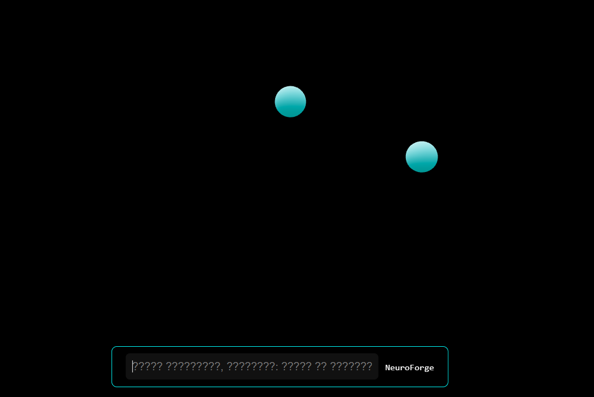
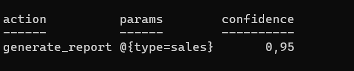
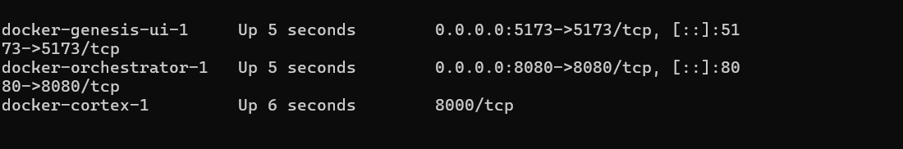
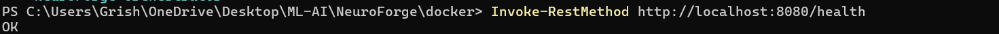
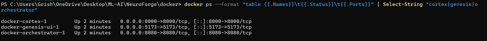

  

  
  
  
  

  
  
  
  
  
  

  
  
  
  
  

 

# 🧠 NeuroForge — The Self-Assembling Operating Environment

> **"This is not an application. This is a living digital organism that builds applications."**
>
> NeuroForge is the world''s first self-assembling operating environment that generates AI-powered 3D interfaces based on user intent. No fixed UI. No static functions. Just pure, evolving intelligence.

 

---

## 🔥 What Makes NeuroForge Revolutionary

### ❌ What NeuroForge DOES NOT have:
- Fixed interface — **no windows, no buttons, no static layouts**
- Predetermined functionality — **nothing is hardcoded**
- Single-purpose design — **it is not an app, it is an app-generator**

### ✅ What NeuroForge HAS:
- **Self-Assembling UI** — 3D interface morphs based on your intent
- **AI Cortex** — local LLM parses natural language into structured actions
- **Immortal State** — CRDT-based persistence that survives reboots
- **Microservice Architecture** — Rust, Python, TypeScript working in harmony
- **Docker Native** — one command to deploy the entire ecosystem

 

---

## 🎯 Live Demonstration

Here''s NeuroForge responding to the intent *"create a sales report with forecast for March"*:

  
   
  <em>Fig 1: Genesis UI — 3D interface with intent visualization nodes</em>

 

### AI Cortex Processing the Request:

  
   
  <em>Fig 2: Cortex API parsing natural language intent into structured actions</em>

 

### Network Proof — Frontend ↔ AI Communication:

  
   
  <em>Fig 3: POST request from 3D UI to AI Cortex with 200 OK response</em>

 

### Orchestrator Health Check:

  
   
  <em>Fig 4: Rust-based orchestrator responding to health checks</em>

 

### Full Microservice Architecture in Docker:

  
   
  <em>Fig 5: All three microservices running in isolated containers</em>

 

---

## ⚙️ Architecture
